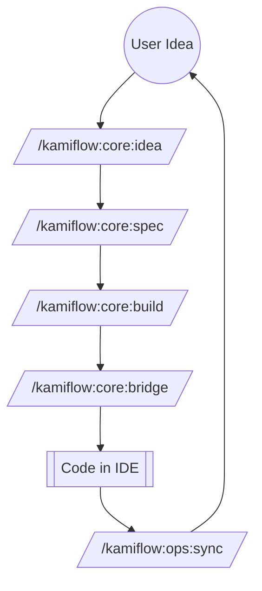

# 🚀 Getting Started with KamiFlow

**Welcome to KamiFlow v2.15** - The rigorous, opinionated "Operating System" for Indie Hackers using Gemini CLI. 

KamiFlow transforms the AI from a generic chatbot into a disciplined **Technical Co-Founder** by enforcing the **Sniper Model** workflow.

---

## ⚡ Quick Start (Portable Track)

Best for users who want to start building **immediately** with zero friction.

### 1. Global Install
Run this in your terminal (Requires Node.js 16+ & Git):
```bash
npx -y github:kamishino/gemini-cli-workflow
```
*This clones the core to `~/.kami-flow` and sets up the `kami` command globally.*

### 2. Initialize Your Project
Navigate to your project folder and run:
```bash
kami init
```
Choose **🔗 Linked Mode** to keep your project updated with the global core.

### 3. Wake Up the AI
Launch Gemini CLI and initialize the session:
```bash
gemini
/kamiflow:ops:wake
```

---

## 🌊 What is KamiFlow?

> **Philosophy:** "Aesthetics + Utility". Ship fast, break nothing important.

### The Sniper Model Workflow
KamiFlow uses a 3-Step Fused Kernel to ensure strategic alignment before any code is written.



### Quick Command Reference

<!-- KAMI_COMMAND_LIST_START -->

### 🎯 Sniper Model (Core Flow)

| Command | Goal |
| :--- | :--- |
| `/kamiflow:core:idea` | **[KamiFlow Sniper] Generate refined idea through diagnostic interview and synthesis (Step 1: Two-Phase Interactive).** |
| `/kamiflow:core:spec` | **[KamiFlow Sniper] Create detailed specification with Schema-First approach (Step 2: Lock 1 & 2).** |
| `/kamiflow:core:build` | **[KamiFlow Sniper] Generate implementation task list with Legacy Awareness (Step 3: Lock 3).** |


### 🌉 The Bridge (IDE Integration)

| Command | Goal |
| :--- | :--- |
| `/kamiflow:core:bridge` | **[KamiFlow] Generate a 'Context Package' prompt for external AI Editors (Windsurf/Cursor).** |


### 🚀 Auto-Pilot (Automation)

| Command | Goal |
| :--- | :--- |
| `/kamiflow:dev:lazy` | **[KamiFlow] Auto-generate S1-S4 artifacts using Sniper Model with mandatory Diagnostic Gate.** |
| `/kamiflow:dev:superlazy` | **[KamiFlow] Auto-generate S1-S4 artifacts AND execute immediately with mandatory Diagnostic Gate.** |
| `/kamiflow:dev:release` | **[KamiFlow] Smart Release Manager - Analyze git history, context, and automate version bumping.** |
| `/kamiflow:dev:upgrade` | **[KamiFlow] Update KamiFlow to the latest version.** |
| `/kamiflow:dev:archive` | **[KamiFlow] Archive completed task artifacts to archive/ folder.** |
| `/kamiflow:dev:revise` | **[KamiFlow] Emergency Brake - Clarify context, resolve hallucinations, and question logic before implementation.** |


### 🧠 Management (Operations)

| Command | Goal |
| :--- | :--- |
| `/kamiflow:ops:wake` | **[KamiFlow] Wake up and reload project context to eliminate session amnesia.** |
| `/kamiflow:ops:help` | **[KamiFlow] Interactive help system for commands and Sniper Model phases.** |
| `/kamiflow:ops:tour` | **[KamiFlow] Guided tour for new projects to explain the Sniper Model.** |
| `/kamiflow:ops:sync` | **[KamiFlow] Read logs from docs/handoff_logs and sync Project Context.** |
| `/kamiflow:ops:roadmap` | **[KamiFlow] Update and visualize the project roadmap in docs/ROADMAP.md.** |
| `/kamiflow:ops:save-context` | **[KamiFlow] Sync current state to PROJECT_CONTEXT.md (Manual Memory Save).** |
| `/kamiflow:ops:bootstrap` | **[KamiFlow] Bootstrap KamiFlow as a Git Submodule - create portal symlinks and initialize proxy files.** |

<!-- KAMI_COMMAND_LIST_END -->

---

## 🎯 Sniper Model Tutorial (Step-by-Step)

Follow this loop for every new feature or bug fix:

### Step 1: The Idea (`/kamiflow:core:idea`)
Tell the AI your raw idea. It will act as a **Consultant**, asking 3-5 probing questions to find the "Root Pain". After you answer, it suggests 3 options (A/B/C).
**Result:** Creates a `tasks/XXX-S1-IDEA-[slug].md` file.

### Step 2: The Spec (`/kamiflow:core:spec`)
Point to your IDEA file. The AI defines User Stories and **Data Models** before logic.
```bash
/kamiflow:core:spec tasks/001-S1-IDEA-my-feature.md
```
**Result:** Creates a `tasks/XXX-S2-SPEC-[slug].md` file.

### Step 3: The Build (`/kamiflow:core:build`)
Break the SPEC into tiny, testable tasks (< 300 lines each).
```bash
/kamiflow:core:build tasks/001-S2-SPEC-my-feature.md
```
**Result:** Creates a `tasks/XXX-S3-BUILD-[slug].md` file.

### Step 4: The Execution (`/kamiflow:core:bridge` or Auto-Pilot)
- **Manual:** Run `/kamiflow:core:bridge` to generate an `S4-HANDOFF` file for your IDE.
- **Auto-Pilot (High Speed):** 
    - `/kamiflow:dev:lazy`: Automates steps 1-4 paperwork.
    - `/kamiflow:dev:superlazy`: Plans **AND** executes code changes natively.

---

## 📦 Detailed Integration (Full Track)

For developers managing complex or multiple projects.

### Option A: Git Submodule
Best for sharing one KamiFlow core across multiple projects.
1. `git submodule add https://github.com/kamishino/gemini-cli-workflow.git .kami-flow`
2. `/kamiflow:ops:wake` (The system will auto-detect and prompt for `/kamiflow:ops:bootstrap`).

### Option B: Standalone Template
Best for high customization.
1. `git clone https://github.com/kamishino/gemini-cli-workflow.git`
2. Remove `.git` folder and run `git init`.

### The Portal Network (Symlinks)
KamiFlow uses **Symbolic Links** to connect the core logic (`.kami-flow/`) to your project root (`.gemini/`, `.windsurf/`). This ensures:
- **Zero Duplication:** Core rules stay in one place.
- **AI Visibility:** Gemini CLI sees the rules at the root level.

---

**Built with ❤️ for the 10x Indie Hacker.**