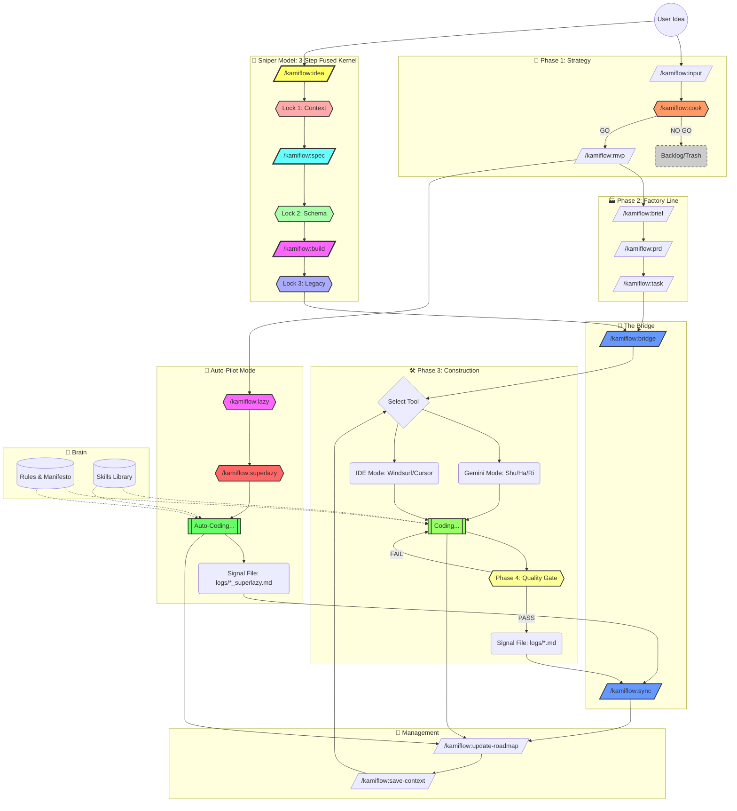

# 🌊 KamiFlow: The Indie Builder's Operating System

> **Philosophy:** "Aesthetics + Utility". Ship fast, break nothing important.

## 🗺️ The Flowchart

This diagram illustrates the lifecycle of a feature in KamiFlow, from raw idea to deployed code.

## 🧭 Navigation Note

The **Management Commands** (`/kamiflow:update-roadmap` and `/kamiflow:save-context`) act as your Compass and Save Button. They can (and should) be invoked at **ANY stage** to:

- Check where you are.
- Update progress.
- Sync context before taking a break.

## ⚡ Quick Command Reference

| Phase          | Command                  | Role               | Goal                                                 |
| :------------- | :----------------------- | :----------------- | :--------------------------------------------------- |
| **🎯 Sniper**  | `/kamiflow:idea`         | Critical Chef      | **Interactive refinement with 3 options (S1).**      |
|                | `/kamiflow:spec`         | Spec Architect     | **Schema-First specification with Lock 1 & 2 (S2).** |
|                | `/kamiflow:build`        | Build Architect    | **Legacy-Aware task generation with Lock 3 (S3).**   |
| **Strategy**   | `/kamiflow:input`        | Idea Collector     | Capture raw thoughts.                                |
|                | `/kamiflow:cook`         | Critical Chef      | Refine idea through technical debate.                |
|                | `/kamiflow:mvp`          | Scope Slasher      | Define Kernel & Cut List.                            |
| **Factory**    | `/kamiflow:brief`        | Architect          | Define modules & boundaries.                         |
|                | `/kamiflow:prd`          | Product Manager    | User stories & Zod schemas.                          |
|                | `/kamiflow:task`         | Lead Dev           | Atomic task checklist + Quality Gate.                |
| **Bridge**     | `/kamiflow:bridge`       | Bridge Builder     | **Pack context for IDE.**                            |
|                | `/kamiflow:sync`         | Integrator         | **Read IDE logs & Update Context.**                  |
| **Build**      | `/kamiflow:shu`          | Mentor             | Explain _WHY_ before coding.                         |
|                | `/kamiflow:ha`           | Partner            | Collaborative optimization.                          |
|                | `/kamiflow:ri`           | 10x Engineer       | Just code. No chatter.                               |
| **Auto-Pilot** | `/kamiflow:lazy`         | One-Man Band       | **Generate S1-S4 artifacts in one chain.**           |
|                | `/kamiflow:superlazy`    | Autonomous Builder | **Generate S1-S4 AND execute immediately.**          |
| **Manage**     | `/kamiflow:wake`         | Memory Keeper      | **Reload project context (Session Recovery).**       |
|                | `/kamiflow:roadmap`      | Planner            | Sync status to `ROADMAP.md`.                         |
|                | `/kamiflow:save-context` | Memory Keeper      | Save RAM to `PROJECT_CONTEXT.md`.                    |
