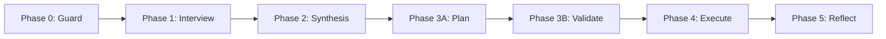

# Cascade Workflow vs KamiFlow: Architecture Comparison

**Document Type:** Architecture Analysis  
**Created:** 2026-01-31  
**Purpose:** Compare Claude Cascade's execution model with KamiFlow Sniper Model

---

## Executive Summary

This document analyzes the workflow patterns of **Claude Cascade** (IDE AI assistant) and **KamiFlow** (Gemini CLI workflow manager) to identify synergies, differences, and potential integration points.

**Key Finding:** Cascade = Lightweight Sniper Model with inline planning, optimized for single-session IDE work. KamiFlow = Heavyweight persistent workflow with git-tracked state, optimized for multi-session collaborative development.

---

## 1. Cascade Workflow Architecture

### 1.1 Core Principles

Claude Cascade operates under strict user-defined rules stored in `.windsurf/rules/`:

```yaml
Foundation Rules:
  - Task Classification: 🟢 Lightweight / 🟡 Standard / 🔴 Critical
  - Response Style: Terse, direct, fact-based
  - Completion Policy: Never stop midway
  - Instruction Priority: System > Workspace > Foundation rules
```

### 1.2 Task Classification System

#### 🟢 Lightweight Tasks

- **Examples:** Few-line modifications, simple bug fixes, config checks
- **Reasoning Policy:** Shortest path, no deep brainstorming
- **Execution Flow:**
  1. Summarize task (1 line)
  2. `read_file` / `grep_search` → `edit`
  3. Report (1-2 sentences, no templates)

#### 🟡 Standard Tasks

- **Examples:** Multi-file changes, API endpoint implementation, component creation
- **Reasoning Policy:** Concise analysis + 3-7 item to-do list
- **Execution Flow:**
  1. Present checklist (`update_plan` tool)
  2. Read files → `edit` / `multi_edit` incrementally
  3. Run lint if possible
  4. Summarize: "What changed, in which files, to what extent"

#### 🔴 Critical Tasks

- **Examples:** Authentication, DB schema, infrastructure config, production changes
- **Reasoning Policy:** Impact analysis + risk assessment + Plan presentation
- **Execution Flow:**
  1. Use `update_plan` tool
  2. **Wait for explicit user approval**
  3. Execute with rollback awareness

### 1.3 Tool Usage Policies

```javascript
// Parallel Execution
✅ read_file, grep_search, code_search, search_web (independent reads)
❌ edit, multi_edit (state-changing operations)

// Command Execution
- Only when explicitly requested or clearly necessary
- Use --yes flags for non-interactive execution
- Blocking: false for long-running processes

// Web Search (Proactive)
- Latest specs/pricing of external services (models, cloud, etc.)
- Version-dependent behavior or breaking changes
- Specific error messages or compatibility issues
```

### 1.4 Code Change Discipline

```markdown
✅ Prefer minimal, focused edits
✅ ALWAYS prefer editing existing files (never write new files unless required)
❌ NEVER output code to chat (use edit tools)
✅ Add all imports, dependencies, endpoints
✅ Break large edits (>300 lines) into smaller chunks
✅ Imports ALWAYS at top of file (separate edit if needed)
```

---

## 2. KamiFlow Workflow Architecture

### 2.1 Core Principles

KamiFlow operates on the **Sniper Model** with persistent git-tracked state:

```yaml
Foundation Rules:
  - Workflow Structure: 7-Phase Sniper Model
  - State Persistence: Git-tracked (ROADMAP.md, PROJECT_CONTEXT.md)
  - Context Intelligence: 60-80% awareness from public files
  - Checkpoints: Resume-able execution across sessions
```

### 2.2 The Sniper Model (7 Phases)



**Checkpoint Locations:**

- Phase 0: Logical Guard complete
- Phase 0.5: Assumption Verification complete
- Phase 1: Diagnostic Interview complete
- Phase 2: Strategic Synthesis complete (S1-IDEA created)
- Phase 3A: Planning complete (S2-SPEC created)
- Phase 3B: Validation complete (S3-BUILD created)
- Phase 4: Work complete (S4-BRIDGE created)

### 2.3 Command Classification

| Command                     | Flow Type           | Approval Gates                  |
| --------------------------- | ------------------- | ------------------------------- |
| `/kamiflow:core:idea`       | Interview → Options | Phase 1, Phase 2                |
| `/kamiflow:core:spec`       | Spec Generation     | Pre-flight validation           |
| `/kamiflow:core:build`      | Plan Generation     | Codebase reconnaissance         |
| `/kamiflow:dev:lazy`        | Full Sniper (Gated) | Phase 1, Phase 2, Phase 3B      |
| `/kamiflow:dev:superlazy`   | Auto-Synthesis      | Phase 1 (brief), Auto Phase 2   |
| `/kamiflow:dev:saiyan`      | Balanced Auto-Mode  | Option B default, minimal gates |
| `/kamiflow:dev:supersaiyan` | God Mode            | Cycle-based oversight           |

### 2.4 State Persistence

```bash
# Git-Tracked State
.kamiflow/
  ├── PROJECT_CONTEXT.md      # Current phase, next step, tech stack
  ├── ROADMAP.md              # Strategic overview, achievements, focus
  └── docs/                   # Generated documentation

# Private Session State (Optional)
.kamiflow-private/
  ├── S1-IDEA-042.md          # Phase 2 checkpoint
  ├── S2-SPEC-042.md          # Phase 3A checkpoint
  ├── S3-BUILD-042.md         # Phase 3B checkpoint
  └── S4-BRIDGE-042.md        # Phase 4 checkpoint

# Resume Workflow
/kamiflow:ops:resume 042     # Restore from last checkpoint
```

---

## 3. Comparative Analysis

### 3.1 Planning & State Management

| Aspect                 | Cascade                          | KamiFlow                          |
| ---------------------- | -------------------------------- | --------------------------------- |
| **Planning Tool**      | `update_plan` (inline TODO list) | S1/S2/S3/S4 artifact files        |
| **State Storage**      | Session memory (ephemeral)       | Git-tracked + private checkpoints |
| **Resume-ability**     | ❌ Full re-run needed            | ✅ Resume from any phase          |
| **Cross-Machine Sync** | ❌ Session-bound                 | ✅ ROADMAP.md syncs globally      |
| **Plan Visibility**    | IDE sidebar only                 | Markdown files (reviewable)       |

### 3.2 Task Classification Mapping

| Cascade        | KamiFlow Equivalent                         | Notes                       |
| -------------- | ------------------------------------------- | --------------------------- |
| 🟢 Lightweight | `/kamiflow:dev:saiyan` (quick fixes)        | Auto-mode, Option B default |
| 🟡 Standard    | `/kamiflow:dev:lazy` (gated full workflow)  | 3-7 checkpoints             |
| 🔴 Critical    | `/kamiflow:dev:superlazy` (strategic build) | Full Sniper with validation |

### 3.3 Approval Gates

| Feature             | Cascade                          | KamiFlow                             |
| ------------------- | -------------------------------- | ------------------------------------ |
| **When Required**   | 🔴 Critical tasks only           | Every Phase 1, Phase 2, Phase 3B     |
| **Mechanism**       | Present plan → wait for approval | Interactive interview + options      |
| **Bypass Option**   | ❌ No bypass                     | ✅ `/saiyan` auto-selects Option B   |
| **Context Loading** | Auto (IDE metadata)              | Explicit `context-sync.md` injection |

### 3.4 Error Recovery

| Level             | Cascade                  | KamiFlow                                     |
| ----------------- | ------------------------ | -------------------------------------------- |
| **Level 1 (80%)** | Auto-fix syntax, imports | TOML syntax, missing imports → Auto-fixed    |
| **Level 2 (15%)** | Ask user for guidance    | Test failures → Guided recovery with options |
| **Level 3 (5%)**  | Escalate to user review  | `/kamiflow:dev:revise` emergency brake       |

### 3.5 Context Intelligence

```markdown
## Cascade (IDE-Integrated)

✅ Workspace layout snapshot (file tree)
✅ Git status (branch, uncommitted changes)
✅ Open files + cursor position
✅ Recent terminal output
❌ No persistent memory across sessions

## KamiFlow (Git-Tracked)

✅ 60-80% awareness from public files (v2.0 protocol)
✅ ROADMAP.md (strategic context)
✅ PROJECT_CONTEXT.md (current state)
✅ .gemini/rules/ (behavioral rules)
✅ Persistent memory across machines
❌ No IDE integration (terminal-based)
```

---

## 4. Synergies & Integration Points

### 4.1 What Cascade Does Better

1. **Quick Iterations**
   - Inline planning with `update_plan` is faster than S1/S2/S3 files
   - No context-sync overhead (IDE auto-loads workspace)
   - Immediate feedback loop (see changes in editor)

2. **Parallel Tool Execution**
   - Multiple `read_file` calls in one turn
   - Faster codebase exploration

3. **Adaptive Reasoning**
   - Less rigid structure (no forced 7-phase workflow)
   - Can switch between 🟢/🟡/🔴 mid-session

### 4.2 What KamiFlow Does Better

1. **Multi-Session Workflows**
   - Resume from checkpoints (S1/S2/S3/S4)
   - No context loss after IDE restart

2. **Team Collaboration**
   - ROADMAP.md syncs via git
   - PROJECT_CONTEXT.md is machine-readable

3. **Strategic Planning**
   - S2-SPEC enforces data models before logic
   - S3-BUILD creates battle-ready implementation plans

4. **Cross-Machine Consistency**
   - 60-80% awareness from public files only
   - Works identically on laptop, desktop, server

### 4.3 Potential Hybrid Workflow

```yaml
Scenario: Quick Feature Addition with Long-Term Tracking

Step 1: Use Cascade for rapid prototyping
  - 🟢 Lightweight task classification
  - Inline planning with update_plan
  - Quick iterations in IDE

Step 2: Export to KamiFlow for documentation
  - /kamiflow:ops:cascade-sync
  - Reads Cascade TODO list
  - Updates PROJECT_CONTEXT.md → Next Step
  - Optionally creates S4-BRIDGE for handoff

Step 3: Use KamiFlow for strategic reflection
  - /kamiflow:ops:roadmap
  - Aggregates feature into ROADMAP.md
  - Updates "Achievements" section

Step 4: Use Cascade for next iteration
  - Loads ROADMAP.md context
  - Continues from updated PROJECT_CONTEXT.md
```

---

## 5. User Rules Alignment

Both systems follow similar principles:

| Principle                | Cascade Rule                    | KamiFlow Equivalent                    |
| ------------------------ | ------------------------------- | -------------------------------------- |
| **No Hallucination**     | "Verify before acting"          | `anti-hallucination.md` protocol       |
| **Minimal Changes**      | "Prefer minimal, focused edits" | `flow-execution.md` → "Surgical edits" |
| **Test Before Commit**   | "Run lint if possible"          | `flow-validation.md` → Phase 3B        |
| **Context First**        | "Read files before editing"     | `context-sync.md` → Mandatory load     |
| **Graceful Degradation** | "Use available tools"           | v2.0 → "60-80% from public files"      |

---

## 6. Recommendations

### For Single-Session Work (< 30 min)

✅ **Use Cascade**

- Faster inline planning
- IDE-integrated context
- No checkpoint overhead

### For Multi-Session Work (> 30 min)

✅ **Use KamiFlow**

- Resume-able checkpoints
- Git-tracked state
- Strategic planning (S1/S2/S3)

### For Collaborative Projects

✅ **Use KamiFlow**

- ROADMAP.md syncs across team
- PROJECT_CONTEXT.md is machine-readable
- Cross-machine consistency

### For Exploratory Prototyping

✅ **Use Cascade**

- Quick experiments
- Adaptive reasoning
- No rigid workflow structure

---

## 7. Future Integration Ideas

### 7.1 Cascade → KamiFlow Export Command

```bash
# New command: /kamiflow:ops:cascade-sync
Description: Export Cascade session state to KamiFlow

Inputs:
  - Cascade TODO list (from update_plan calls)
  - IDE file changes (git diff)
  - Terminal command history

Outputs:
  - Updated PROJECT_CONTEXT.md → Next Step
  - Optional S4-BRIDGE.md (if mid-workflow)
  - ROADMAP.md achievement entry

Use Case:
  - End of Cascade session
  - Want to preserve state for later resume
  - Transition from prototyping to strategic planning
```

### 7.2 KamiFlow Cascade-Mode Command

```bash
# New command: /kamiflow:dev:cascade-mode [task]
Description: Simulate Cascade's lightweight workflow

Behavior:
  - Skip Phase 1 interview (use task description directly)
  - Auto-select "Balanced" option (no Phase 2 gate)
  - Inline planning (no S1/S2/S3 files)
  - Report results in 1-2 sentences

Use Case:
  - Quick bug fixes
  - Config changes
  - Simple refactors
```

### 7.3 Unified Error Recovery Protocol

```markdown
Merge `error-recovery.md` (KamiFlow) with Cascade's auto-fix logic:

Level 1 (Auto-Fix):

- Cascade: Syntax, imports, formatting
- KamiFlow: TOML syntax, missing imports
- Unified: Add linting auto-fix, type errors

Level 2 (Guided Recovery):

- Cascade: Present options to user
- KamiFlow: Test failures → recovery strategies
- Unified: Add conflict resolution wizard

Level 3 (Escalation):

- Cascade: Manual review
- KamiFlow: /kamiflow:dev:revise
- Unified: Add "Rollback to checkpoint" option
```

---

## 8. Conclusion

**Cascade and KamiFlow are complementary, not competitive.**

- **Cascade** = Speed, adaptability, IDE integration
- **KamiFlow** = Structure, persistence, strategic planning

**Best Practice:**

1. Use **Cascade** for rapid prototyping and quick fixes
2. Use **KamiFlow** for strategic feature development
3. Export Cascade state to KamiFlow at session boundaries
4. Load KamiFlow context (ROADMAP, PROJECT_CONTEXT) into Cascade for continuity

**Next Steps:**

- [ ] Implement `/kamiflow:ops:cascade-sync` command
- [ ] Add `/kamiflow:dev:cascade-mode` lightweight workflow
- [ ] Create unified error recovery protocol
- [ ] Document hybrid workflow in `docs/power-user-guide.md`

---

## References

- `resources/blueprints/commands/context-sync.md` - KamiFlow context loading
- `.windsurf/rules/kamiflow-rules.md` - Cascade user rules for KamiFlow awareness
- `packages/kamiflow-cli/docs/overview.md` - KamiFlow workflow overview
- `docs/adr/003-sniper-model-workflow.md` - Sniper Model architecture
- `.gemini/rules/context-intelligence-v2.md` - v2.0 public-file-first protocol
