# 🌊 KamiFlow: The Indie Builder's Operating System

> **Philosophy:** "Aesthetics + Utility". Ship fast, break nothing important.

## 🗺️ The Flowchart

This diagram illustrates the lifecycle of a feature in KamiFlow, from raw idea to deployed code.

```mermaid
graph TD
    %% Nodes
    Start((User Idea))

    subgraph Sniper_Phase [🎯 Sniper Model: 3-Step Fused Kernel]
        Idea[/"/kamiflow:core:idea"/]
        Spec[/"/kamiflow:core:spec"/]
        Build[/"/kamiflow:core:build"/]
        Lock1{{Lock 1: Context}}
        Lock2{{Lock 2: Schema}}
        Lock3{{Lock 3: Legacy}}
    end

    subgraph Bridge [🌉 The Bridge]
        Handoff[/"/kamiflow:core:bridge"/]
        Sync[/"/kamiflow:ops:sync"/]
    end

    subgraph Construction_Phase [🛠 Construction & Execution]
        IdeMode(IDE Mode: Windsurf/Cursor)
        Code[[Coding...]]
        QualityGate{{"Phase 4: Quality Gate"}}
        LogFile(Signal File: logs/*.md)
    end

    subgraph Autopilot_Phase [🚀 Auto-Pilot Mode]
        Lazy{{"/kamiflow:dev:lazy"}}
        SuperLazy{{"/kamiflow:dev:superlazy"}}
        AutoCode[[Auto-Coding...]]
        AutoLog(Signal File: logs/*_superlazy.md)
    end

    subgraph Knowledge_Base [🧠 Brain]
        Rules[(Rules & Manifesto)]
        Skills[(Skills Library)]
    end

    subgraph Management [🧠 Management]
        Roadmap[/"/kamiflow:ops:roadmap"/]
        Save[/"/kamiflow:ops:save-context"/]
    end

    %% Flow
    %% Sniper Path (Primary)
    Start --> Idea
    Idea --> Lock1
    Lock1 --> Spec
    Spec --> Lock2
    Lock2 --> Build
    Build --> Lock3
    Lock3 --> Handoff

    %% Auto-Pilot Path
    Start --> Lazy
    Lazy --> SuperLazy
    SuperLazy --> AutoCode
    AutoCode --> AutoLog

    Handoff --> IdeMode
    IdeMode --> Code

    Code --> QualityGate
    QualityGate -- PASS --> LogFile
    QualityGate -- FAIL --> Code

    LogFile --> Sync
    AutoLog --> Sync

    Rules -.-> Code
    Skills -.-> Code
    Rules -.-> AutoCode
    Skills -.-> AutoCode

    Code --> Roadmap
    AutoCode --> Roadmap
    Sync --> Roadmap
    Roadmap --> Save
    Save --> Start

    %% Styling
    style Code fill:#9f6,stroke:#333,stroke-width:2px
    style QualityGate fill:#ff9,stroke:#333,stroke-width:2px
    style Handoff fill:#69f,stroke:#333,stroke-width:2px
    style Sync fill:#69f,stroke:#333,stroke-width:2px
    style Lazy fill:#f6f,stroke:#333,stroke-width:2px
    style SuperLazy fill:#f66,stroke:#333,stroke-width:2px
    style AutoCode fill:#6f6,stroke:#333,stroke-width:2px
    style Idea fill:#ff6,stroke:#333,stroke-width:3px
    style Spec fill:#6ff,stroke:#333,stroke-width:3px
    style Build fill:#f6f,stroke:#333,stroke-width:3px
    style Lock1 fill:#faa,stroke:#333,stroke-width:2px
    style Lock2 fill:#afa,stroke:#333,stroke-width:2px
    style Lock3 fill:#aaf,stroke:#333,stroke-width:2px
```

## 🧭 Navigation Note

The **Management Commands** (`/kamiflow:ops:roadmap` and `/kamiflow:ops:save-context`) act as your Compass and Save Button. They can (and should) be invoked at **ANY stage** to:

- Check where you are.
- Update progress.
- Sync context before taking a break.

## ⚡ Quick Command Reference

| Phase          | Command                  | Role               | Goal                                                       |
| :------------- | :----------------------- | :----------------- | :--------------------------------------------------------- |
| **🎯 Sniper**  | `/kamiflow:core:idea`    | Critical Chef      | **Interactive refinement with 3 options (S1-IDEA).**       |
|                | `/kamiflow:core:spec`    | Spec Architect     | **Schema-First specification with Lock 1 & 2 (S2-SPEC).**  |
|                | `/kamiflow:core:build`   | Build Architect    | **Legacy-Aware task generation with Lock 3 (S3-BUILD).**   |
| **Bridge**     | `/kamiflow:core:bridge`  | Bridge Builder     | **Pack context for IDE (S4-HANDOFF).**                     |
|                | `/kamiflow:ops:sync`     | Integrator         | **Read IDE logs & Update Context.**                        |
| **Auto-Pilot** | `/kamiflow:dev:lazy`     | One-Man Band       | **Auto-generate all 4 Sniper artifacts in one chain.**     |
|                | `/kamiflow:dev:superlazy`| Autonomous Builder | **Auto-generate all 4 Sniper artifacts AND execute code.** |
| **Manage**     | `/kamiflow:ops:wake`     | Memory Keeper      | **Reload project context (Session Recovery).**             |
|                | `/kamiflow:ops:roadmap`  | Planner            | Sync status to `ROADMAP.md`.                               |
|                | `/kamiflow:ops:save-context` | Memory Keeper      | Save RAM to `PROJECT_CONTEXT.md`.                          |
