# 🌊 KamiFlow: The Indie Builder's Operating System

> **Philosophy:** "Aesthetics + Utility". Ship fast, break nothing important.

## 🗺️ The Flowchart

This diagram illustrates the lifecycle of a feature in KamiFlow, from raw idea to deployed code.

```mermaid
graph TD
    %% Nodes
    Start((User Idea))

    subgraph Sniper_Phase [🎯 Sniper Model: 3-Step Fused Kernel]
        Idea[/"/kamiflow:core:idea"/]
        Spec[/"/kamiflow:core:spec"/]
        Build[/"/kamiflow:core:build"/]
        Lock1{{Lock 1: Context}}
        Lock2{{Lock 2: Schema}}
        Lock3{{Lock 3: Legacy}}
    end

    subgraph Bridge [🌉 The Bridge]
        Handoff[/"/kamiflow:core:bridge"/]
        Sync[/"/kamiflow:ops:sync"/]
    end

    subgraph Construction_Phase [🛠 Construction & Execution]
        IdeMode(IDE Mode: Windsurf/Cursor)
        Code[[Coding...]]
        QualityGate{{"Phase 4: Quality Gate"}}
        LogFile(Signal File: logs/*.md)
    end

    subgraph Autopilot_Phase [🚀 Auto-Pilot Mode]
        Lazy{{"/kamiflow:dev:lazy"}}
        SuperLazy{{"/kamiflow:dev:superlazy"}}
        AutoCode[[Auto-Coding...]]
        AutoLog(Signal File: logs/*_superlazy.md)
    end

    subgraph Knowledge_Base [🧠 Brain]
        Rules[(Rules & Manifesto)]
        Skills[(Skills Library)]
    end

    subgraph Management [🧠 Management]
        Roadmap[/"/kamiflow:ops:roadmap"/]
        Save[/"/kamiflow:ops:save-context"/]
    end

    %% Flow
    %% Sniper Path (Primary)
    Start --> Idea
    Idea --> Lock1
    Lock1 --> Spec
    Spec --> Lock2
    Lock2 --> Build
    Build --> Lock3
    Lock3 --> Handoff

    %% Auto-Pilot Path
    Start --> Lazy
    Lazy --> SuperLazy
    SuperLazy --> AutoCode
    AutoCode --> AutoLog

    Handoff --> IdeMode
    IdeMode --> Code

    Code --> QualityGate
    QualityGate -- PASS --> LogFile
    QualityGate -- FAIL --> Code

    LogFile --> Sync
    AutoLog --> Sync

    Rules -.-> Code
    Skills -.-> Code
    Rules -.-> AutoCode
    Skills -.-> AutoCode

    Code --> Roadmap
    AutoCode --> Roadmap
    Sync --> Roadmap
    Roadmap --> Save
    Save --> Start

    %% Styling
    style Code fill:#9f6,stroke:#333,stroke-width:2px
    style QualityGate fill:#ff9,stroke:#333,stroke-width:2px
    style Handoff fill:#69f,stroke:#333,stroke-width:2px
    style Sync fill:#69f,stroke:#333,stroke-width:2px
    style Lazy fill:#f6f,stroke:#333,stroke-width:2px
    style SuperLazy fill:#f66,stroke:#333,stroke-width:2px
    style AutoCode fill:#6f6,stroke:#333,stroke-width:2px
    style Idea fill:#ff6,stroke:#333,stroke-width:3px
    style Spec fill:#6ff,stroke:#333,stroke-width:3px
    style Build fill:#f6f,stroke:#333,stroke-width:3px
    style Lock1 fill:#faa,stroke:#333,stroke-width:2px
    style Lock2 fill:#afa,stroke:#333,stroke-width:2px
    style Lock3 fill:#aaf,stroke:#333,stroke-width:2px
```

## 🧭 Navigation Note

The **Management Commands** (`/kamiflow:ops:roadmap` and `/kamiflow:ops:save-context`) act as your Compass and Save Button. They can (and should) be invoked at **ANY stage** to:

- Check where you are.
- Update progress.
- Sync context before taking a break.

## ⚡ Quick Command Reference

<!-- KAMI_COMMAND_LIST_START -->

| Command | Folder | Goal |
| :--- | :--- | :--- |
| `/kamiflow:core:bridge` | core | **[KamiFlow] Generate a 'Context Package' prompt for external AI Editors (Windsurf/Cursor).** |
| `/kamiflow:core:build` | core | **[KamiFlow Sniper] Generate implementation task list with Legacy Awareness (Step 3: Lock 3).** |
| `/kamiflow:core:idea` | core | **[KamiFlow Sniper] Generate refined idea through diagnostic interview and synthesis (Step 1: Two-Phase Interactive).** |
| `/kamiflow:core:spec` | core | **[KamiFlow Sniper] Create detailed specification with Schema-First approach (Step 2: Lock 1 & 2).** |
| `/kamiflow:dev:archive` | dev | **[KamiFlow] Archive completed task artifacts to archive/ folder.** |
| `/kamiflow:dev:lazy` | dev | **[KamiFlow] Auto-generate S1-S4 artifacts using Sniper Model with mandatory Diagnostic Gate.** |
| `/kamiflow:dev:release` | dev | **[KamiFlow] Smart Release Manager - Analyze git history, context, and automate version bumping.** |
| `/kamiflow:dev:revise` | dev | **[KamiFlow] Emergency Brake - Clarify context, resolve hallucinations, and question logic before implementation.** |
| `/kamiflow:dev:superlazy` | dev | **[KamiFlow] Auto-generate S1-S4 artifacts AND execute immediately with mandatory Diagnostic Gate.** |
| `/kamiflow:dev:upgrade` | dev | **[KamiFlow] Update KamiFlow to the latest version.** |
| `/kamiflow:ops:bootstrap` | ops | **[KamiFlow] Bootstrap KamiFlow as a Git Submodule - create portal symlinks and initialize proxy files.** |
| `/kamiflow:ops:help` | ops | **[KamiFlow] Interactive help system for commands and Sniper Model phases.** |
| `/kamiflow:ops:roadmap` | ops | **[KamiFlow] Update and visualize the project roadmap in docs/ROADMAP.md.** |
| `/kamiflow:ops:save-context` | ops | **[KamiFlow] Sync current state to PROJECT_CONTEXT.md (Manual Memory Save).** |
| `/kamiflow:ops:sync` | ops | **[KamiFlow] Read logs from docs/handoff_logs and sync Project Context.** |
| `/kamiflow:ops:tour` | ops | **[KamiFlow] Guided tour for new projects to explain the Sniper Model.** |
| `/kamiflow:ops:wake` | ops | **[KamiFlow] Wake up and reload project context to eliminate session amnesia.** |

<!-- KAMI_COMMAND_LIST_END -->
