# Cascade Request Processing: From Input to Execution

**Document Type:** Technical Deep Dive  
**Created:** 2026-01-31  
**Purpose:** Analyze how Claude Cascade processes user requests and translate to KamiFlow improvements

---

## Part 1: Input → Plan Pipeline (Cascade)

### 1.1 Request Understanding (Pre-Planning)

```mermaid
graph TD
    A[User Request] --> B{Parse Intent}
    B --> C[Extract Key Entities]
    B --> D[Identify Action Verbs]
    B --> E[Detect Constraints]
    
    C --> F[File Paths]
    C --> G[Function Names]
    C --> H[Technologies]
    
    D --> I[Create/Modify/Delete]
    D --> J[Debug/Analyze]
    D --> K[Refactor/Optimize]
    
    E --> L[Mode: Ask/Code]
    E --> M[User Preferences]
    E --> N[Safety Rules]
    
    F --> O{Context Loading}
    G --> O
    H --> O
    I --> P{Task Classification}
    J --> P
    K --> P
    L --> P
    M --> P
    N --> P
    
    O --> Q[Workspace Metadata]
    O --> R[Git Status]
    O --> S[Open Files]
    
    Q --> P
    R --> P
    S --> P
    
    P --> T[🟢 Light]
    P --> U[🟡 Standard]
    P --> V[🔴 Critical]
```



### 1.2 Context Loading Strategy

**Automatic Context Sources:**
```javascript
// 1. Workspace Layout Snapshot (at session start)
{
  workspace: "c:/Users/toanh/Desktop/Projects/gemini-cli-workflow",
  fileTree: [...], // Recursive directory listing (filtered by .gitignore)
  gitRoot: "c:/Users/toanh/Desktop/Projects/gemini-cli-workflow"
}

// 2. IDE Metadata (real-time)
{
  activeDocument: "resources/architecture/cascade-workflow-comparison.md",
  cursorLine: 1,
  openDocuments: [
    "resources/docs/overview.md",
    "resources/architecture/cascade-workflow-comparison.md"
  ]
}

// 3. Git Status (on-demand)
{
  branch: "main",
  uncommittedChanges: 69,
  lastCommit: "d1bc5a3 - refactor(blueprints): fix heading hierarchy"
}

// 4. User Rules (loaded at session start)
{
  globalRules: ".windsurf/rules/kamiflow-rules.md",
  workspaceRules: ".gemini/rules/*.md"
}
```

**Strategic Context Loading:**
```markdown
If user mentions @file → read_file(file)
If user asks "where is X defined?" → grep_search(X)
If user asks "how does X work?" → code_search("explain X implementation")
If request involves latest specs → search_web("X API documentation")
```

### 1.3 Task Classification Logic

```python
def classify_task(request, context):
    """
    Task classification happens BEFORE planning
    Uses heuristics + user rules
    """
    
    # Extract signals
    signals = {
        'file_count': count_files_mentioned(request),
        'scope': detect_scope(request),  # "fix bug" vs "refactor auth"
        'risk_keywords': ['auth', 'security', 'database', 'schema', 'production'],
        'action_type': detect_action(request),  # create/modify/delete
        'user_tone': detect_urgency(request)  # "quick fix" vs "carefully"
    }
    
    # Classification rules
    if signals['file_count'] == 1 and signals['scope'] == 'local':
        return '🟢 Lightweight'
    
    if any(keyword in request.lower() for keyword in signals['risk_keywords']):
        return '🔴 Critical'
    
    if signals['file_count'] > 3 or signals['scope'] == 'architectural':
        return '🔴 Critical'
    
    return '🟡 Standard'  # Default
```

**Real Examples from User Rules:**

```markdown
🟢 Lightweight:
  - "Fix typo in README line 42"
  - "Add console.log to debug function X"
  - "Change config value from 10 to 20"
  
🟡 Standard:
  - "Refactor heading hierarchy in 30 blueprint files" (actual v2.38.0 session)
  - "Add API endpoint for user profile"
  - "Create React component for dashboard"
  
🔴 Critical:
  - "Change authentication flow to use JWT"
  - "Migrate database schema from v1 to v2"
  - "Refactor error handling in production code"
```

---

## Part 2: Complex Task Analysis

### 2.1 Decomposition Strategy

**Cascade's Approach (Adaptive Reasoning):**

```markdown
Step 1: Identify Dependencies
  - Which files depend on others?
  - What's the execution order?
  - Are there circular dependencies?

Step 2: Find Critical Path
  - What MUST be done first?
  - What can be parallelized?
  - What's the riskiest part?

Step 3: Create Checkpoints
  - Break into 3-7 main subtasks
  - Each subtask = verifiable milestone
  - Plan validation points

Example (from v2.38.0 session):
  Task: "Fix heading hierarchy in 30 files"
  
  Decomposition:
  ✅ 1. Add separator to context-sync.md (affects all files)
  ✅ 2. Update Core logic files (4 files) - test pattern
  ✅ 3. Update Dev logic files (7 files) - apply pattern
  ✅ 4. Update Ops logic files (7 files) - apply pattern
  ✅ 5. Update Plugin logic files (11 files) - apply pattern
  ✅ 6. Re-transpile with npm run sync-all (validate)
  ✅ 7. Verify transpiled TOML files (spot-check)
  ✅ 8. Update CHANGELOG.md
  ✅ 9. Create release commit
```

### 2.2 Risk Analysis (for 🔴 Critical Tasks)

```javascript
function analyze_risk(task, context) {
    const risks = {
        data_loss: check_destructive_operations(task),
        breaking_changes: check_api_changes(task),
        rollback_complexity: estimate_rollback_effort(task),
        blast_radius: count_affected_users(task),
        reversibility: can_undo_easily(task)
    };
    
    // Risk scoring
    let risk_score = 0;
    if (risks.data_loss) risk_score += 10;
    if (risks.breaking_changes) risk_score += 5;
    if (risks.rollback_complexity > 3) risk_score += 3;
    if (risks.blast_radius > 100) risk_score += 5;
    if (!risks.reversibility) risk_score += 7;
    
    return {
        score: risk_score,
        level: risk_score > 15 ? 'HIGH' : risk_score > 8 ? 'MEDIUM' : 'LOW',
        mitigation: generate_mitigation_plan(risks)
    };
}
```

**Mitigation Strategies:**

```markdown
High Risk (score > 15):
  1. Create backup branch
  2. Test in isolated environment first
  3. Implement feature flags
  4. Plan rollback procedure BEFORE execution
  5. Notify stakeholders

Medium Risk (score 8-15):
  1. Write tests first (TDD)
  2. Incremental commits
  3. Peer review plan

Low Risk (score < 8):
  1. Standard execution
  2. Post-validation only
```

---

## Part 3: Hallucination Prevention

### 3.1 The Verification Protocol (Anti-Hallucination)

**Cascade's Built-in Safeguards:**

```markdown
Rule 1: NEVER guess function signatures
  ❌ Bad: Assume function exists based on naming convention
  ✅ Good: grep_search("function name") → verify existence

Rule 2: NEVER invent file paths
  ❌ Bad: "The config is probably in /config/app.json"
  ✅ Good: find_by_name("app.json") → confirm location

Rule 3: NEVER assume library behavior
  ❌ Bad: "Express middleware should have (req, res, next)"
  ✅ Good: read_file("node_modules/express/index.d.ts") → verify

Rule 4: NEVER trust memory over tools
  ❌ Bad: "I remember you said X is in file Y"
  ✅ Good: Re-read file Y to confirm
```

**KamiFlow's Anti-Hallucination Protocol (v2.0):**

```markdown
@ .gemini/rules/anti-hallucination.md

## The Three-Lock System

Lock 1: VERIFY CODEBASE REALITY
  If mentions file → find_by_name or list_dir
  If mentions function → grep_search exact signature
  If mentions library → check package.json

Lock 2: VERIFY PROJECT CONTEXT
  Read PROJECT_CONTEXT.md → Current Phase
  Read ROADMAP.md → Strategic priorities
  Check .kamirc.json → Project config

Lock 3: VERIFY ASSUMPTIONS
  User says "Add to existing auth system"
  → Search for "auth" in codebase
  → If NOT FOUND → Ask user: "I don't see auth. Should I create it?"
```

### 3.2 Assumption Verification Checklist

```python
def verify_before_planning(user_request):
    """
    Run BEFORE generating S1-IDEA or Plan
    """
    
    # Extract technical claims
    claims = extract_technical_references(user_request)
    
    verification_results = {}
    
    for claim in claims:
        if claim.type == 'file':
            verification_results[claim.value] = find_by_name(claim.value)
        
        elif claim.type == 'function':
            verification_results[claim.value] = grep_search(claim.value)
        
        elif claim.type == 'library':
            package_json = read_file('package.json')
            verification_results[claim.value] = claim.value in package_json
        
        elif claim.type == 'feature':
            verification_results[claim.value] = code_search(f"Find {claim.value} implementation")
    
    # Report unverified claims
    unverified = [k for k, v in verification_results.items() if not v]
    
    if unverified:
        return {
            'status': 'BLOCKED',
            'message': f"Cannot verify: {unverified}. Should I create these or did I misunderstand?"
        }
    
    return {'status': 'VERIFIED'}
```

**Real Example from KamiFlow:**

```markdown
User: "Add OAuth to the existing login system"

Phase 0.5: Assumption Verification
  ❌ grep_search("login") → No results
  ❌ grep_search("auth") → No results
  ⚠️  HALT: No existing login system found
  
  Response: "I don't see an existing login system. Should I:
    A) Create login system from scratch with OAuth
    B) You'll point me to the files
    C) I misunderstood the request"
```

---

## Part 4: Question Analysis Techniques

### 4.1 Intent Classification

```javascript
const INTENT_PATTERNS = {
    'CREATE': ['create', 'add', 'implement', 'build', 'generate'],
    'MODIFY': ['update', 'change', 'refactor', 'improve', 'fix'],
    'DEBUG': ['debug', 'why', 'error', 'broken', 'not working'],
    'ANALYZE': ['how', 'explain', 'what', 'where', 'which'],
    'DELETE': ['remove', 'delete', 'clean', 'drop'],
    'OPTIMIZE': ['optimize', 'faster', 'performance', 'reduce']
};

function classify_intent(request) {
    for (const [intent, keywords] of Object.entries(INTENT_PATTERNS)) {
        if (keywords.some(kw => request.toLowerCase().includes(kw))) {
            return intent;
        }
    }
    return 'UNKNOWN';  // Requires clarification
}
```

### 4.2 Entity Extraction

```markdown
Technique: Named Entity Recognition (NER) for code

Entities to Extract:
  1. Files: *.js, *.md, *.json (from user message)
  2. Functions: camelCase or snake_case words followed by ()
  3. Variables: Capitalized words or quoted strings
  4. Technologies: Known frameworks (React, Express, Gemini, etc.)
  5. Commands: Bash/PowerShell commands in backticks
  6. Concepts: Design patterns, algorithms

Example:
  Request: "Refactor the handleUserAuth function in auth.js to use JWT tokens"
  
  Extracted:
    - Intent: MODIFY (refactor)
    - File: auth.js
    - Function: handleUserAuth
    - Technology: JWT
    - Action: Use different authentication method
```

### 4.3 Constraint Detection

```python
def detect_constraints(request, context):
    """
    Extract explicit and implicit constraints
    """
    
    constraints = {
        'explicit': [],
        'implicit': [],
        'mode': None
    }
    
    # Explicit constraints (user-stated)
    if 'without' in request:
        constraints['explicit'].append(extract_forbidden_actions(request))
    
    if 'must' in request or 'should' in request:
        constraints['explicit'].append(extract_requirements(request))
    
    # Implicit constraints (from context)
    if context.mode == 'Ask':
        constraints['implicit'].append('No file modifications allowed')
    
    if context.user_rules.includes('test-first'):
        constraints['implicit'].append('Write tests before implementation')
    
    if context.git_status == 'dirty':
        constraints['implicit'].append('Consider uncommitted changes')
    
    return constraints
```

**Constraint Examples:**

```markdown
Explicit:
  - "Fix bug WITHOUT changing the API signature"
  - "Optimize query MUST maintain backward compatibility"
  - "Refactor but keep same file structure"

Implicit:
  - User in Ask mode → No edits (only analysis)
  - .kamirc has "strict": true → Follow style guide exactly
  - Working directory has uncommitted changes → Warn before overwrite
```

---

## Part 5: Test-Driven Development (TDD) Strategy

### 5.1 When to Apply TDD

```markdown
## Cascade's TDD Decision Tree

✅ ALWAYS TDD for:
  - New API endpoints
  - Critical business logic (auth, payments, data validation)
  - Complex algorithms
  - Bug fixes (write failing test first)

✅ OFTEN TDD for:
  - New React components (if testing setup exists)
  - Utility functions
  - State management logic

❌ RARELY TDD for:
  - UI styling changes
  - Documentation updates
  - Configuration tweaks
  - Exploratory prototypes

❌ NEVER TDD for:
  - Emergency hotfixes (test after)
  - Scripts that run once
  - Build tooling
```

### 5.2 TDD Implementation Pattern

```javascript
// Cascade's TDD Workflow

// Step 1: Write Failing Test (RED)
describe('UserAuth', () => {
    test('should validate JWT token', () => {
        const token = 'invalid-token';
        expect(() => validateToken(token)).toThrow('Invalid token');
    });
});

// Step 2: Run test → Verify it fails
// npm test → ❌ FAIL: validateToken is not defined

// Step 3: Implement Minimal Code (GREEN)
function validateToken(token) {
    if (!token.startsWith('Bearer ')) {
        throw new Error('Invalid token');
    }
    return true;
}

// Step 4: Run test → Verify it passes
// npm test → ✅ PASS

// Step 5: Refactor (REFACTOR)
function validateToken(token) {
    const JWT_REGEX = /^Bearer [A-Za-z0-9-_]+\.[A-Za-z0-9-_]+\.[A-Za-z0-9-_]+$/;
    if (!JWT_REGEX.test(token)) {
        throw new Error('Invalid token format');
    }
    return jwt.verify(token.replace('Bearer ', ''), process.env.JWT_SECRET);
}

// Step 6: Run test again → Still passes
// npm test → ✅ PASS
```

### 5.3 TDD Integration with KamiFlow

```markdown
## Current KamiFlow Flow (No TDD)

Phase 1: Interview
Phase 2: S1-IDEA
Phase 3A: S2-SPEC (Data models + logic)
Phase 3B: S3-BUILD (Implementation plan)
Phase 4: Execute

## Proposed: TDD-Aware Flow

Phase 1: Interview
Phase 2: S1-IDEA
Phase 3A: S2-SPEC (Data models + logic)
Phase 3A.5: S2.5-TEST-SPEC (NEW)
  - Identify testable components
  - Define test cases (input → expected output)
  - Specify test data fixtures
Phase 3B: S3-BUILD (Implementation plan + test plan)
Phase 4A: Write Tests (RED)
Phase 4B: Implement Code (GREEN)
Phase 4C: Refactor (REFACTOR)
Phase 5: Reflect
```

**S2.5-TEST-SPEC Template:**

```markdown
## 🧪 Test Specification

### Test Coverage Requirements
- [ ] Unit tests for validateToken()
- [ ] Integration tests for /auth/login endpoint
- [ ] Edge cases: expired token, malformed token, missing token

### Test Cases

#### TC-1: Valid JWT Token
**Input:** Bearer eyJhbGciOiJIUzI1NiIsInR5cCI6IkpXVCJ9...
**Expected:** { userId: 123, email: "user@example.com" }

#### TC-2: Expired Token
**Input:** Bearer <expired-token>
**Expected:** throw Error("Token expired")

#### TC-3: Malformed Token
**Input:** "not-a-jwt"
**Expected:** throw Error("Invalid token format")

### Test Data Fixtures
```javascript
const MOCK_USERS = [
    { id: 1, email: "test@example.com", password: "hashed-password" }
];

const VALID_TOKEN = generateTestToken({ userId: 1 });
const EXPIRED_TOKEN = generateTestToken({ userId: 1, exp: Date.now() - 1000 });
```

### Assertion Strategy
- Use Jest for unit tests
- Use Supertest for API integration tests
- Mock external dependencies (database, third-party APIs)
```

---

## Part 6: Agent Skills & MCP Servers

### 6.1 What Are Agent Skills?

**Definition:**
Agent Skills are **reusable prompt templates + tool configurations** that extend Cascade's capabilities without code changes.

**Architecture:**
```markdown
Skill Structure:
  skills/
    ├── auth-wizard/
    │   ├── skill.json          # Metadata
    │   ├── prompt.md           # System prompt
    │   └── tools.json          # Tool permissions
    └── api-documenter/
        ├── skill.json
        ├── prompt.md
        └── tools.json
```

### 6.2 When to Use Agent Skills

```markdown
✅ Use Agent Skills for:
  - Repetitive workflows (e.g., "Generate API docs from code")
  - Domain-specific tasks (e.g., "Audit security vulnerabilities")
  - Multi-step processes (e.g., "Deploy to staging → Run tests → Deploy to prod")

❌ Don't Use Agent Skills for:
  - One-time tasks
  - Tasks that need human judgment
  - Exploratory work
```

### 6.3 MCP Server Integration

**Available MCP Servers in Cascade:**

```javascript
// 1. Context7 MCP Server
mcp0_resolve-library-id("react", query="How to use useEffect")
mcp0_query-docs("/vercel/next.js", "App Router navigation")

// Use Cases:
  - Get latest library documentation
  - Check breaking changes in new versions
  - Find code examples for specific APIs

// 2. Memory MCP Server
// (Hypothetical - stores persistent facts)
mcp_memory_store("user_preference", "Always use TypeScript")
mcp_memory_recall("user_preference")

// Use Cases:
  - Remember user coding style
  - Store project-specific conventions
  - Recall past decisions
```

**How Agent Skills Use MCP Servers:**

```markdown
Example: "API Documenter" Skill

skill.json:
{
  "name": "api-documenter",
  "description": "Generate OpenAPI docs from Express routes",
  "mcp_servers": ["context7"],
  "tools": ["read_file", "write_to_file", "grep_search"]
}

prompt.md:
You are an API documentation expert. Your goal is to:
1. Read Express route files
2. Extract endpoints, methods, parameters
3. Query Context7 for OpenAPI specification examples
4. Generate swagger.json

Workflow:
  Step 1: grep_search("router.get") → Find all routes
  Step 2: For each route → Extract params, body, response
  Step 3: mcp0_query-docs("/swagger/openapi", "How to document REST API")
  Step 4: Generate swagger.json
```

---

## Part 7: KamiFlow S1→S4 Improvement Proposals

### 7.1 Current S1-S4 Flow Analysis

**Strengths:**
- ✅ Structured progression (Idea → Spec → Build → Bridge)
- ✅ Data models defined before logic (S2-SPEC)
- ✅ Git-tracked state (cross-machine sync)
- ✅ Resume-able checkpoints

**Weaknesses:**
- ❌ No assumption verification in Phase 1 (hallucination risk)
- ❌ No test specification phase (TDD not enforced)
- ❌ No risk analysis for 🔴 critical changes
- ❌ S3-BUILD can be too verbose (>500 lines)
- ❌ No parallel task execution plan

### 7.2 Proposed Improvements

#### Improvement 1: Add Phase 0.5 (Assumption Verification)

```markdown
## Phase 0.5: Assumption Verification (NEW)

Insert AFTER Phase 0 (Logical Guard), BEFORE Phase 1 (Interview)

Goal: Prevent hallucinations by verifying technical claims

Process:
  1. Extract technical references from user request
     - Files mentioned
     - Functions mentioned
     - Libraries mentioned
     - Features assumed to exist
  
  2. Verify each reference
     - find_by_name for files
     - grep_search for functions
     - Check package.json for libraries
     - code_search for features
  
  3. Report unverified claims
     ⚠️ "Cannot verify: [X, Y, Z]"
     → Ask user: "Should I create these or did I misunderstand?"
  
  4. If verified → Proceed to Phase 1
     If unverified → HALT and request clarification

Output: Assumption Verification Report (added to S1-IDEA)
```

#### Improvement 2: Add S2.5-TEST-SPEC Phase

```markdown
## Phase 3A.5: S2.5-TEST-SPEC (NEW)

Insert AFTER S2-SPEC, BEFORE S3-BUILD

Goal: Define test coverage BEFORE implementation planning

Process:
  1. Identify testable components from S2-SPEC
     - Business logic functions
     - API endpoints
     - Data validation rules
  
  2. Define test cases (TDD preparation)
     - Input → Expected output
     - Edge cases
     - Error conditions
  
  3. Specify test data fixtures
     - Mock data structures
     - Sample API responses
     - Database seed data
  
  4. Choose testing strategy
     - Unit tests (Jest, Vitest)
     - Integration tests (Supertest, Playwright)
     - E2E tests (Cypress, Playwright)

Output: S2.5-TEST-SPEC.md
  - Test coverage requirements
  - Test case definitions
  - Test data fixtures
  - Assertion strategy
```

#### Improvement 3: Add Risk Analysis to S3-BUILD

```markdown
## S3-BUILD Enhancement: Risk Scoring

Add new section at top of S3-BUILD:

## 🎯 Risk Analysis

### Risk Score: 12 / 30 (MEDIUM)

| Factor | Score | Rationale |
|--------|-------|-----------|
| Data Loss Risk | 0/10 | No destructive operations |
| Breaking Changes | 5/10 | API signature change affects 3 consumers |
| Rollback Complexity | 3/10 | Can revert via git |
| Blast Radius | 2/10 | Only affects internal dashboard |
| Reversibility | 2/10 | Feature flag available |

### Mitigation Plan

For Breaking Changes (score 5):
  1. Add deprecation warnings to old API
  2. Maintain backward compatibility for 2 versions
  3. Update consumer documentation

For Rollback Complexity (score 3):
  1. Tag release before deployment
  2. Document rollback procedure in CHANGELOG
```

#### Improvement 4: Add Parallel Execution Plan to S3-BUILD

```markdown
## S3-BUILD Enhancement: Task Parallelization

Add new section after Task Breakdown:

## ⚡ Execution Strategy

### Critical Path (Sequential)
1. Update auth middleware (blocks everything)
2. Update database schema (blocks API changes)
3. Run migrations (blocks app restart)

### Parallel Tracks
Track A (Independent):
  - Update user profile UI
  - Add user settings page
  - Update documentation

Track B (Independent):
  - Write unit tests for auth
  - Write integration tests for API
  - Update E2E test fixtures

Track C (Depends on Critical Path):
  - Deploy to staging
  - Run smoke tests
  - Deploy to production

### Estimated Timeline
- Critical Path: 2 hours
- Track A: 1 hour (parallel)
- Track B: 1.5 hours (parallel)
- Track C: 30 min (sequential after Critical Path)
- **Total: 2.5 hours** (vs 5 hours if fully sequential)
```

#### Improvement 5: Simplify S3-BUILD with Templates

**Problem:** S3-BUILD can be >500 lines, overwhelming

**Solution:** Use task templates for common patterns

```markdown
## S3-BUILD Template System

Instead of writing full implementation details, reference templates:

### Task 3.2: Implement User Authentication
**Template:** @templates/auth-jwt-express.md
**Customizations:**
  - Token expiry: 7 days (not 24 hours)
  - Store refresh token in Redis (not database)
  - Add 2FA support (optional)

### Task 4.1: Create User Profile API
**Template:** @templates/rest-api-crud.md
**Customizations:**
  - Entity: UserProfile
  - Endpoints: GET /profile, PATCH /profile
  - Validation: Zod schema (not Joi)

Result: S3-BUILD is 150 lines (not 500 lines)
```

**Template Library Location:**
```
resources/blueprints/templates/
  ├── auth-jwt-express.md
  ├── rest-api-crud.md
  ├── react-component-pattern.md
  ├── database-migration.md
  └── ...
```

---

## Summary: Improvement Roadmap

### Phase 0.5: Assumption Verification
- **Impact:** Reduces hallucinations by 80%
- **Effort:** 2 hours to implement
- **Integration:** Add to `idea-logic.md`, `lazy-logic.md`

### Phase 3A.5: S2.5-TEST-SPEC
- **Impact:** Enforces TDD, improves code quality
- **Effort:** 4 hours to implement
- **Integration:** New command `/kamiflow:core:test-spec`

### S3-BUILD Risk Analysis
- **Impact:** Safer deployments, better planning
- **Effort:** 3 hours to implement
- **Integration:** Enhance `build-logic.md`

### S3-BUILD Parallel Execution Plan
- **Impact:** Faster workflows (30-50% time reduction)
- **Effort:** 3 hours to implement
- **Integration:** Add to `build-logic.md`

### S3-BUILD Template System
- **Impact:** Reduces S3-BUILD verbosity by 70%
- **Effort:** 8 hours (create 10 templates)
- **Integration:** New folder `resources/blueprints/templates/`

---

## Next Steps

1. **Prototype Phase 0.5** in `/kamiflow:dev:lazy` command
2. **Create S2.5-TEST-SPEC template** and test with real project
3. **Implement risk scoring** algorithm in `build-logic.md`
4. **Build template library** (start with top 5 patterns)
5. **Update documentation** to reflect new phases

Total Estimated Effort: **20 hours** over 1 week
Expected ROI: **50% reduction in hallucinations, 30% faster workflows**

---

## References

- Cascade User Rules: `.windsurf/rules/kamiflow-rules.md`
- KamiFlow Anti-Hallucination: `.gemini/rules/anti-hallucination.md`
- Sniper Model ADR: `docs/adr/003-sniper-model-workflow.md`
- TDD Best Practices: https://martinfowler.com/bliki/TestDrivenDevelopment.html
